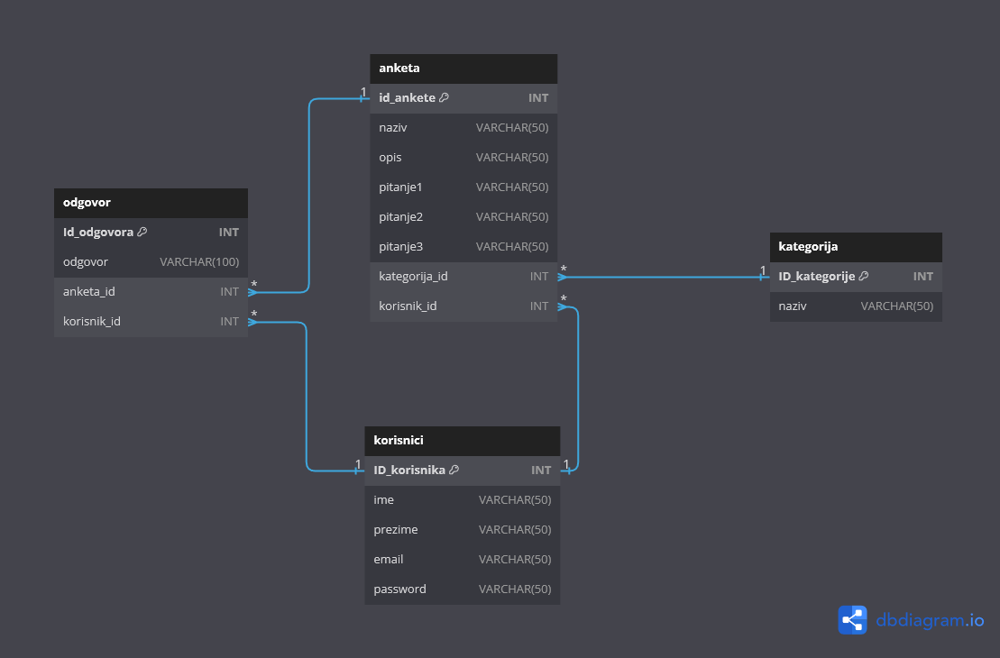

# Projekt iz kolegija Projektiranje sustava e-učenja

# Aplikacija za anketiranje studentata

**Tehnologije**

- Laravel 
- Vue 
- HTML 
- CSS 
- JavaScript 
- Bootstrap 
- jQuery 
- MySQL
- ... 

**Opis projekta** 

- *Za dodavati anketu potrebna je registracija pa prijava korisnika. Korisnik koji je prijavljen ima mogućnost da dodaje, uređuje i briše ankete. Korisnik može samo jednom da glasuje na određenu anketu.*
- *...* 
 

**Relacijski model baze podataka:** 

